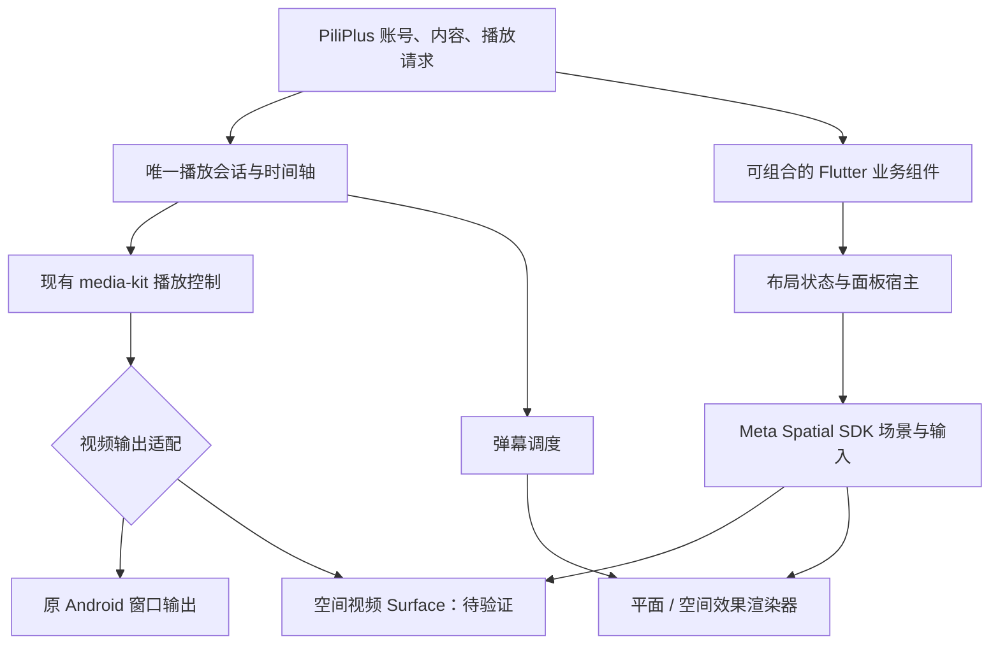

# PiliPlus 空间版：Quest 3 界面与实现设计

设计日期：2026-09-22。状态：交互设计与技术预研，尚未实现或验收 Quest APK。

2026-09-24 补充：当前首版范围、页面流程和交互规则以 [V1 功能与 UI 设计稿](V1-FUNCTIONAL-UI-DESIGN.md) 为准。本文件保留较广的方案研究，笔记和实验效果不自动进入 V1。

## 1. 已确定的方向

以 [PiliPlus](https://github.com/bggRGjQaUbCoE/PiliPlus) 为唯一客户端基础，保留账号、搜索、推荐、选集、播放解析、字幕、弹幕与历史记录。产品目标是：**在 Quest 3 上，把视频及其周边功能摆成适合自己的观看空间。**

这次决定取代初步调研中“原生空间版另选 BiliTVNative 作为业务基础”的建议。可以借鉴原生空间示例，但不再并行迁移另一套 B 站客户端。

第一版的核心是普通视频、一个播放会话、三种可切换布局。自由摆放和透明组件应成为日常观看工具；3D 弹幕是用户主动开启的效果层。普通视频仍是平面内容，立体弹幕不会使视频人物自动变成立体或从画面中走出。

## 2. 参考什么、借鉴什么

详细链接、视频时间点和证据边界见 [VR-UI-REFERENCES.md](VR-UI-REFERENCES.md)。这里保留影响本方案的结论：

| 参考 | 对本方案的启发 |
| --- | --- |
| YouTube 的 Quest 普通窗口与沉浸模式 | 浏览与观看使用不同布局，进入影院时保留播放进度；控制栏按需显示 |
| YouTube 空间版设计团队访谈，平台为 Vision Pro | 将评论、播放控制等拆成可重组模块，让同一内容适应紧凑窗口和大屏观看；这是已发布产品的设计思路 |
| Quest 浏览器观看 Netflix 的实际演示 | 调整大小、位置、曲面和环境亮度应当直接可达；第二窗口适合伴随观看 |
| SKYBOX、Moon VR 的使用演示与官方说明 | 将距离、大小、俯仰、回中分开，不能只有一个模糊的“缩放”操作 |
| Netflix Vision Pro 概念设计文章 | 借鉴浏览列表、详情、工具栏的空间层级；它是设计师概念稿，不能作为 Netflix 已实现功能的证据 |

截至本次检索，Netflix 的官方 Quest 使用说明指向 Quest Browser。旧 VR 客厅只能作为历史参考。Vision Pro 的眼动输入不能直接搬到 Quest 3；本方案以手柄射线、手势射线与捏合为输入基础。[YouTube 帮助](https://support.google.com/youtube/answer/7205134?hl=en)、[Netflix 帮助](https://help.netflix.com/en/node/110502)

## 3. 三种布局，共用一套组件

### 专注影院：默认入口

中央保留视频和字幕，观看时收起选集与评论；点按视频或使用手柄按钮唤出播放控制。底部保留可快速找回的组件入口。用户可以保留透视背景并调暗，也可切换简洁影院背景。

暂停、快进、音量、画质、字幕与弹幕密度是第一层操作。距离、曲率、环境设置进入第二层。进入影院只改变布局与显示模式，不创建第二个播放器。

### 空间桌面：边看边查

视频居中，选集或稍后再看在左侧，评论/弹幕列表在右侧；笔记按需展开。最多默认展示“主屏 + 两个辅助面板”，其余收进组件栏。布局选择是预设起点，用户能继续调整。

适合教程、长视频和合集。评论列表、实时弹幕列表应使用明确标签区分；它们的数据时序不同，不能把普通评论当成正在播放时刻的弹幕。

### 弹幕陪伴：直播间式观看

主屏略偏左，右侧显示弹幕文字流或精选评论，屏幕下方可以出现一条弹幕河流。即便内容是点播，也可以呈现“边看边聊”的布局；多人同步观影、语音聊天室和真正直播接入不由这个布局自动提供。

第一版优先单人点播，直播功能沿用 PiliPlus 实际能力另行验收。陪伴布局与河流效果分别开关，切换布局不自动打开声音或大量动画。

## 4. 多窗口怎样组件化

### 组件目录

| 组件 | 内容与行为 | 首版优先级 |
| --- | --- | --- |
| 主视频 | 唯一播放器，保留宽高比、进度、音轨 | 必需 |
| 播放控制条 | 暂停、时间轴、画质、字幕、声音；通常依附主屏 | 必需 |
| 选集 / 播放队列 | 分 P、合集、下一集、稍后再看 | 必需 |
| 字幕 | 与播放时间同步，默认处于屏幕下部固定阅读区 | 必需 |
| 弹幕 | 平面覆盖、列表、空间效果共享同一条时间轴 | 必需，效果分阶段 |
| 评论 / 视频详情 | 独立于实时弹幕，可收起 | 后续 |
| 笔记 / 时间书签 | 保存视频时间点，输入键盘按需出现 | 后续；原型仅作示意 |

组件不等于独立应用、独立 Flutter 引擎或独立视频解码器。先建立统一组件接口，再按渲染需求决定采用 Flutter 面板、原生 UI 或空间文字实体。

如果后续要同时播放两路视频，例如一边直播、一边回看，应明确新增多播放会话，默认只让一路有声，并单独验证双路解码、音频焦点和功耗。复制一个面板不应隐式启动另一个播放器；首版仍聚焦一条稳定的视频流。

### 每个组件具有相同的摆放规则

组件状态包含：稳定 ID、类型、内容引用、可见性、锚定方式、位置与旋转、物理尺寸、背景不透明度、锁定状态、输入策略、布局版本号。显示状态与内容状态分开保存，不把登录凭证、媒体签名地址放入布局配置。

提供两种日常锚定方式：

- **跟随主屏**：保存相对位置。拖动主屏时，选集、控制栏等一起移动；适合整组迁移。
- **固定在工作区**：组件位置独立；适合把笔记留在旁边。初期仅保证本次会话和相对布局恢复。跨重启、跨房间的真实空间锚点，需要另外验证定位、权限与失效恢复。

默认不让大面板持续跟着头部转动。提供“全部召回到面前”，帮助找回视野之外的面板。主屏回中、整组回中和恢复默认布局应是不同命令；完整实现应保留每种布局的用户配置。

### 摆放流程

1. 从组件栏打开所需组件。
2. 进入“摆放”后显示抓取条与边角。手柄抓取拖动、手势捏合抓取；正文区域继续用于滚动和点击。
3. 远近通过显式距离控件或手柄操作调整，尺寸单独调整；可吸附到主屏两侧/下缘，也可自由摆放。
4. 使用“跟随主屏”和“锁定”结束布置；退出摆放后隐藏抓取辅助线。
5. 丢失位置时一键召回；恢复失败时回到默认布局，不出现不可见却拦截输入的面板。

目标是允许自由摆放，同时让初始布局不需要反复扭头。字号、距离与命中范围应在头显中按视角验证，不能将桌面 CSS 像素直接换成 VR 舒适标准。[Meta 舒适度指南](https://developers.meta.com/horizon/design/comfort/)、[手势 UI 指南](https://developers.meta.com/horizon/design/hands-ui-best-practices/)

**能力边界：**应用可以管理自己创建的这些面板；不能据此承诺将微信、浏览器等任意第三方应用嵌入自己的空间并控制其透明度。其他应用的窗口由 Horizon OS 管理。单个普通 Android 窗口内部，也无法让控件真正飞出它的窗口边界。

## 5. 透明度拆成四个独立设置

| 设置 | 默认策略 | 原因 |
| --- | --- | --- |
| 辅助面板背景不透明度 | 原型从 86% 起，可调；阅读困难时提高 | 保留真实环境，又不牺牲阅读；调低数值意味着更透明 |
| 文字与操作控件 | 保持清晰，必要时增加文字背板 | 不对整个组件直接设置统一 alpha，避免文字一起消失 |
| 视频画面 | 默认 100% 不透明 | 保证对比度、黑位与字幕清晰度，并保留直接视频输出的性能路径 |
| 环境亮度 | 与上述设置独立 | 让用户调暗房间或透视背景，而非误把视频变暗 |

无内容的透明边缘应尽量不拦截点击；标题栏、按钮、正文需要明确命中区域。关闭或完全隐藏的组件应关闭射线命中。这里的命中策略不等于运行时一定支持逐像素穿透，须按面板宿主能力验证。

视频透明化作为后续实验功能，不能把 UI 的 alpha 属性直接套到视频合成层。Meta 文档区分直接 Surface 输出与可读取场景纹理的路径，透明选项、合成路径和后处理能力存在约束；透明模型还涉及深度写入与排序。优先采用“不透明视频 + 独立透明 UI”，限制透明面板重叠层数。[媒体播放](https://developers.meta.com/horizon/documentation/spatial-sdk/spatial-sdk-media-playback/)、[混合模式](https://developers.meta.com/horizon/documentation/spatial-sdk/spatial-sdk-blend-modes/)

## 6. 3D 弹幕：先有规则，再做效果

### 三个候选效果

| 效果 | 设计 | 初始试验参数，非已验证标准 |
| --- | --- | --- |
| 河流 | 沿主屏下缘或侧下方的弧形轨道流动，保留字幕与操作区域 | 同屏先限 8–12 条，每条约 5–8 秒；拥挤时抽样，不加速塞入 |
| 跳出 | 用户选中或本地精选的少量文字从屏幕边缘浅浅浮出，再退场 | 同时最多 1 条，约 3–4 秒；深度先限制在主屏前方 5–15 厘米附近 |
| 精选朗读 | 用户点选朗读某条，后续可选小规模自动精选 | 默认关闭；同时一个声音；队列最多 2 条；过期就丢弃 |

这些数值只是比较实验的起点，需要按屏幕距离、字号、视角、实际负载与用户舒适度调整。“5–15 厘米”是相对主屏的局部深度，不是把文字放到眼前。不要让文字冲向头部、绕身飞行或要求用户追踪近远快速变化的对象。

河流优先试验，因为它能保留弹幕氛围并让视频中央更干净。跳出作为强调效果，避免所有弹幕争夺注意力。保留经典平面弹幕与完全关闭两个对照选项。

### 与现有弹幕系统的连接

```text
PiliPlus 弹幕解析、屏蔽、去重
        ↓
统一播放时间轴与调度器
        ├─ 经典平面弹幕
        ├─ 列表视图
        └─ 本地规则选择 → 河流 / 跳出 / 朗读
```

保留用户原来的屏蔽规则；空间化只改变呈现方式。普通弹幕文本不能执行任意脚本、加载任意模型或自行触发声音，效果限定为本地预设。第一版不要求 AI 服务；关键词、用户点选、允许列表、频率限制即可验证体验。

暂停时停止运动调度；拖动进度、切视频、退出播放时清空旧效果和语音队列。恢复后按新的播放位置重新取弹幕，不把旧队列追赶式喷出。倍速改变时，弹幕时间按播放器时钟对齐，动画速度可以独立限幅，以免快到无法阅读。

### 朗读与空间声音

第一版先做“点一下读这一条”，用系统可用 TTS 验证语言、发音、延迟、音频焦点和取消行为。中文语音可能需要设备额外提供，不能假设 Quest 已安装可用中文声音。

后续若做空间声源，应让声音来自弹幕组件附近，位置稳定、音量可控；不要让每条文字成为环绕移动声源。TTS 输出并不天然具有空间定位，可能需要合成音频再交给空间音频引擎。朗读期间是否轻微降低视频音量由用户选择；关闭朗读、快进或切视频应立即取消。

原型里的朗读使用浏览器现有语音能力，只验证交互意图；未实现 Quest TTS 或双耳空间音频。

## 7. 基于 PiliPlus 怎么改

### 已核查的代码事实

本次读取 PiliPlus 提交 `a0e6148e928bf2d7f6e14599cab01bde2a0630f7`。`pubspec.yaml` 对 media-kit 使用了 Git fork 覆盖，不能仅根据依赖区的版本号判断实际播放器源码。

`lib/plugin/pl_player/controller.dart` 已有 `PlPlayerController`、播放器/视频控制器、媒体请求头、弹幕控制等逻辑。应围绕它新增布局与渲染适配，保留播放语义。

另行读取 media-kit fork 的 `native` 分支快照 `73771ec38176be2d984a3049c28177bce23b54a0`，其 Android `VideoOutput.java` 通过 `TextureRegistry.SurfaceTextureEntry` 创建 `Surface`，交给 libmpv。这个事实说明现有输出依赖 Flutter 纹理，**不证明已有“接收任意外部 Surface”的现成接口**。该 fork 快照也不等于已核实 PiliPlus lockfile 最终锁定的提交。

源码证据：[依赖与覆盖](https://github.com/bggRGjQaUbCoE/PiliPlus/blob/a0e6148e928bf2d7f6e14599cab01bde2a0630f7/pubspec.yaml)、[播放器控制器](https://github.com/bggRGjQaUbCoE/PiliPlus/blob/a0e6148e928bf2d7f6e14599cab01bde2a0630f7/lib/plugin/pl_player/controller.dart)、[Android 视频输出](https://github.com/My-Responsitories/media-kit/blob/73771ec38176be2d984a3049c28177bce23b54a0/media_kit_video/android/src/main/java/com/alexmercerind/media_kit_video/VideoOutput.java)

### 推荐结构



建议新增布局模型、组件注册表、统一播放状态事件、空间宿主接口和弹幕渲染接口。接口名称与目录在真正建立 fork 后按项目规范确定，不在设计阶段伪造已经存在的模块。

### 技术路线与三个探针

先在普通 Flutter 窗口里拆好组件，做横屏、命中区域、手柄与手势输入。这部分在独立空间面板失败时仍可交付。

需要真正独立摆放、曲面屏或飞出窗口的弹幕时，优先评估 **Kotlin + Meta Spatial SDK 的空间宿主**。Unity/OpenXR 是复杂场景或跨平台扩展的备选，目前没有充分理由为第一版搬走全部 Dart 业务。

在扩大开发前依次验证：

1. **Flutter 面板宿主**：最小 Flutter UI 能否进入选定的空间面板，正确接收射线、捏合、滚动、返回和系统键盘，并经受面板关闭/重开。官方 Android 面板支持不能直接推导为 Flutter 已无缝兼容。
2. **独立视频输出**：当前 media-kit/libmpv 路径能否接入空间宿主提供的 Surface；比较直接输出与 Flutter 纹理路径的清晰度、硬解、音画、内存与恢复。先用本地 H.264/AAC，再接同一 B 站素材。处理 Surface 创建、替换、销毁，确保旧引用释放。
3. **透明 UI 与空间效果**：不透明视频上叠加 UI 与少量文字实体，检查双眼遮挡、深度排序、字幕清晰度和帧时间，再尝试多面板。

不应一开始就给每个小组件创建一个 FlutterEngine。先验证一个业务面板配合原生空间控制组件；确有必要时再试 `FlutterEngineGroup`。多个引擎拥有独立的 Dart 执行与状态，不能假设它们共享同一个 GetX 控制器；应通过明确定义的消息与唯一业务状态源同步，并测量内存/启动开销。[Flutter 多实例说明](https://docs.flutter.dev/add-to-app/multiple-flutters)

如果现有视频输出不能以合理改动接入，则先交付普通窗口版本，独立记录替代播放器或更多原生 UI 的成本。Media3 是待比较的备选，不是已决定替换；替换会扩大请求头、分离音视频、字幕、倍速、恢复等回归范围。

## 8. 实施顺序与退出条件

| 阶段 | 交付 | 通过条件 |
| --- | --- | --- |
| D0：设计 | 交互草案、资料索引、测试矩阵 | 可以讨论组件、透明度与效果取舍；不声称设备可运行 |
| P0：Quest 基线 | 固定上游与构建依赖的 PiliPlus 测试包 | 搜索、播放、拖进度、选集、手势、待机恢复可复现；留下一份原版基线 |
| P1：组件化窗口版 | 三种布局、组件开关、输入改进 | 同一播放会话；状态不丢失；不因切布局重播或双重发声 |
| P2：原生空间探针 | 一个视频面板 + 一个可交互面板 | 三个技术探针有实际证据；失败时先保留 P1，不继续叠加复杂效果 |
| P3：空间工作区 | 组件摆放、吸附、锁定、召回、透明背景 | 手柄/手势均可完成；退出恢复与面板释放正常 |
| P4：弹幕增强 | 河流，随后跳出、精选朗读 | 与平面/关闭对照；长时播放、舒适度与性能通过再默认推荐 |

平台工具：Android Studio、项目固定的 Flutter SDK、MQDH/ADB；空间阶段增加 Meta Spatial SDK 与其官方样例，按需要使用 Spatial Editor。模拟器用于早期布局与输入检查，真机负责视频质量、双眼深度、真实手势、功耗与舒适度。

## 9. 原型实际覆盖了什么

本次会话中的交互草案包含三种预设、组件开关、宽屏拖动、方向微调、跟随主屏、位置锁定、大小/距离示意、背景不透明度、环境调暗、三种弹幕演示及精选朗读入口。视频画面和片单均为示例内容。

这是一份二维交互草案：距离通过视觉缩放示意，弹出效果通过投影动画示意。它没有 Quest 双眼渲染、实际空间锚点、手势 SDK、PiliPlus 网络请求或真实视频解码。切换预设会恢复该预设布局，完整产品则应保存各预设的用户调整。

本次脚本语法、29 个控件/节点 ID 的唯一性、已查询 ID 与标签目标、文件体积/片段格式、文档本地链接检查通过；浏览器自动化连接不可用，尚未完成浏览器渲染及实际点击验收。设备端也未构建、安装或测试。真机用例和新增空间交互用例见 [QUEST3-TEST-PLAN.md](QUEST3-TEST-PLAN.md)。
