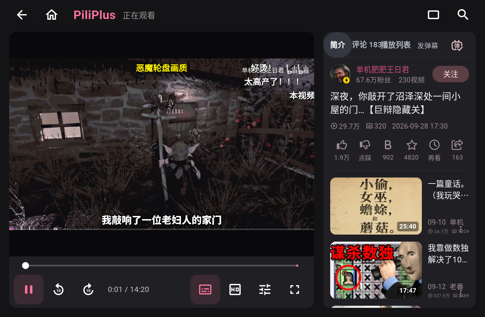
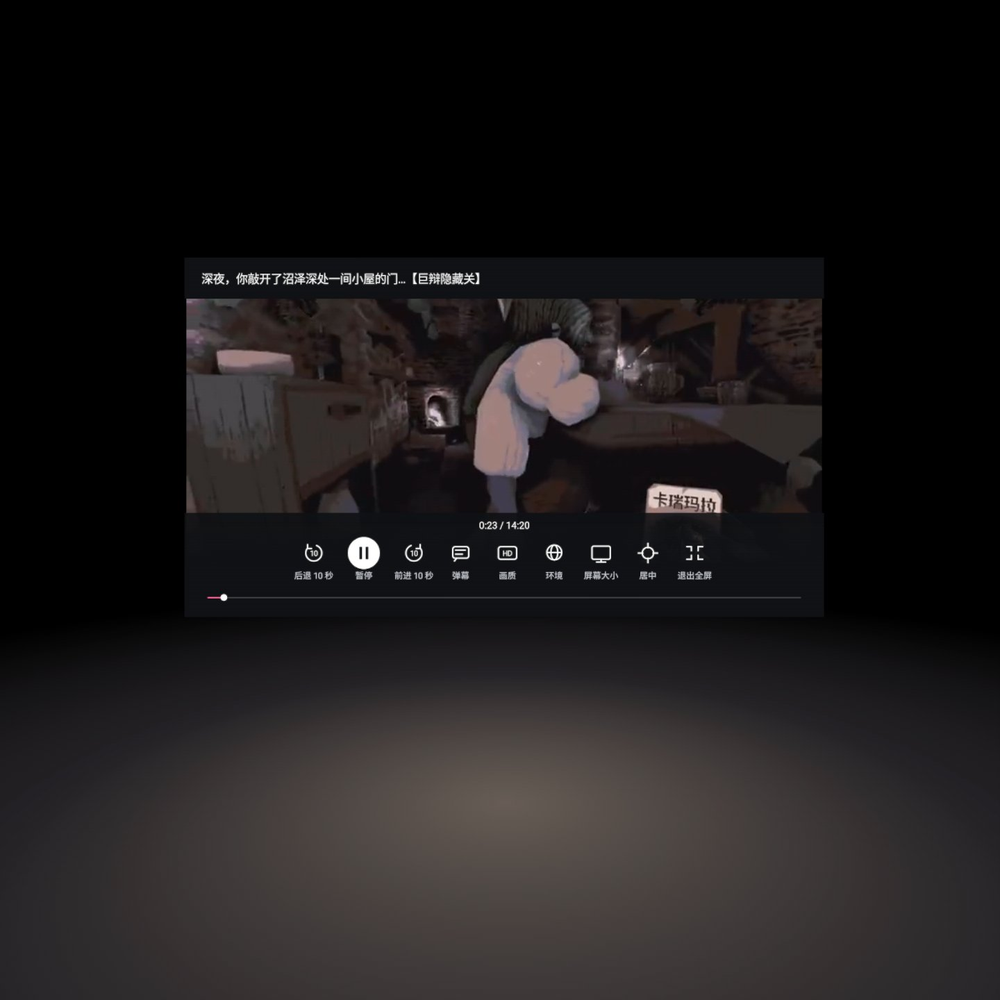
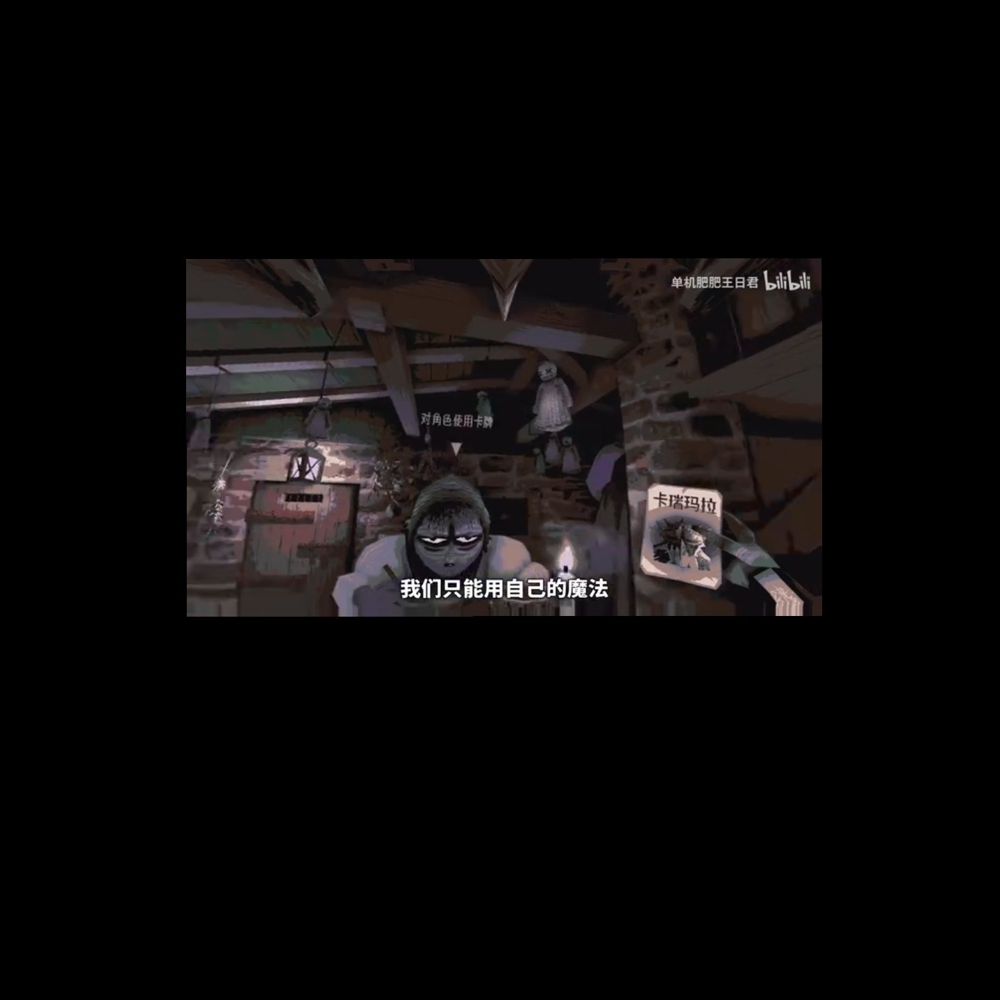

# VRBiliBili

基于 [PiliPlus](https://github.com/bggRGjQaUbCoE/PiliPlus) 的 Quest 3 大屏 B 站客户端。使用原生 Android / Flutter 界面浏览与播放，通过 Meta Spatial SDK / OpenXR 进入沉浸影院。

**当前阶段：0.1.0-rc.4 预发布版（APK 0.1.0 / code 4），实机验收未完成。** 不是 B 站官方客户端；不代表 B 站或 Meta。已验证设备为 Quest 3，不宣称支持 SteamVR 或其他 OpenXR 设备。

## 功能

- 大屏首页、搜索、动态、个人媒体库及播放详情；账号和内容能力沿用 PiliPlus。
- 点击视频自动播放，播放栏直接访问弹幕、画质、设置和全屏影院。
- 影院支持播放/暂停、前后 10 秒、画质切换、小/中/大屏幕、居中与退出。
- 深色影院、浅色空间、纯画面及混合现实；进入影院默认关闭透视。
- 纯画面隐藏布景与弹幕，返回影院恢复弹幕偏好。播放时控件自动隐藏。
- 影院按钮默认只显示图标，悬停、聚焦或按下时显示文字提示；菜单保留文字。
- 两个播放器交接进度，退出影院后保持暂停，避免同时发声。

## 真实运行截图

下图是 **2026-10-04 Quest 3 开发版播放真实 B 站内容的截图**，不是原型或 B 站官方 App 截图。图中视频画面及 UP 主信息属于对应内容方，仅展示客户端实际运行。影院截图早于“文字仅悬停显示”的最后修改，不作为 0.1.0 Release 的验收证据。

公开截图仅展示应用窗口或关闭透视的虚拟影院，不包含现实房间、桌面或其他家庭环境。2026-10-05 实测中含房间透视的原始截图仅保存在本地，不加入仓库、Release 或源码附件。

### 播放详情



### 沉浸影院



### 纯画面



## 安装

从 [GitHub Release](https://github.com/znbsf/VRBiliBili/releases/tag/v0.1.0-rc.4) 下载 APK、源码和 SHA256；校验结果见 [Release 说明](docs/RELEASE.md)。尚未发布商店版本，也没有把开发版自动测试通过视为 Release 验收通过。

```powershell
adb -s QUEST_SERIAL install -r VRBiliBili-0.1.0-4-quest-arm64.apk
```

正式包名为 `io.github.vrbilibili.quest`；开发版是 `io.github.vrbilibili.quest.debug`，两者并存、数据独立。正式版首次使用需要重新登录，不会读取或删除开发版的账号与历史。

## 构建

需要已配置的 Android SDK、Java 17 和项目使用的补丁版 Flutter；具体依赖和上游版本见 [客户端来源](clients/piliplus/VRBILIBILI-UPSTREAM.md)。

```powershell
# 开发版
./tools/Build-QuestApp.ps1 -Mode debug -TargetPlatform android-arm64
# 正式版：先配置私有 android/key.properties，不能使用 debug 签名回退
./tools/Build-QuestApp.ps1 -Mode release -TargetPlatform android-arm64 -BuildName 0.1.0 -BuildNumber 4
```

影院目前保留 Meta Spatial SDK 0.14.0，APK 包含 OpenXR loader。这不是移除 Meta SDK 后的跨设备纯 OpenXR 重写。参见 [Meta OpenXR 支持说明](https://developers.meta.com/vr/documentation/native/android/mobile-openxr/)。

## 验证与限制

- 2026-10-04 开发版自动回归覆盖：4K 普通播放、影院解码及切源、环境/尺寸、纯画面、进度交接、重复进出和返回主页。
- 2026-10-05 正式候选 code 4 已实测普通播放及影院进入/连续显示，本次未复现旧候选的影院启动崩溃；影院退出、进度交接和空间布局仍未完成验收。见 [实机复核](docs/QUEST-CONFIRM-20261005.md)。
- 自动点击回调不等于手柄射线验收。悬停提示、手势、佩戴舒适度、长时间播放及休眠恢复仍需实机确认。
- 先前验收曾遇到 Quest 系统追踪/控制器提示和焦点占位窗口；code 4 的新证据不代表这些设备状态下的恢复路径已通过。
- 地面柔光为静态纹理；未实现实时视频反射、弧形屏幕和浏览小窗。
- 模拟器验证二维界面及共享影院控件，不验证 XR 场景或透视效果。

当前机器可读结果见 [验证记录](docs/quest-client-validation.json)，历史迭代见 [UI 实施记录](docs/QUEST-UI-REFERENCE-IMPLEMENTATION.md)。

## 来源与历史资料

原生客户端源代码位于 [clients/piliplus](clients/piliplus)，保留 [PiliPlus GPL 许可证](clients/piliplus/LICENSE) 及各依赖许可。分发构建时应同时提供对应版本的源码及构建说明；本地签名密钥与账号数据不属于公开源码。

HTML 原型、空间多窗口设计和技术探针仅作历史参考，不代表当前产品：[首版设计](V1-FUNCTIONAL-UI-DESIGN.md)、[历史原型](prototype-preview.html)、[播放技术探针](docs/REAL-PLAYBACK-PROBE.md)、[Quest 开发说明](docs/QUEST-CLIENT.md)。

## 发布审查

本次按项目维护者决定提供当前候选预发布版，实际 XR 验收与 GPL / Meta Spatial SDK 分发审查仍未完成；预发布不代表这些事项已解决。详见 [分发审查](docs/BINARY-DISTRIBUTION-REVIEW.md)；正式签名不等于公开发布条件已满足。

## 后续计划

[纯 OpenXR 迁移](docs/OPENXR-MIGRATION.md)：移除 Meta Spatial SDK 依赖并保留现有影院功能，完成真实设备验证后另行发布。
