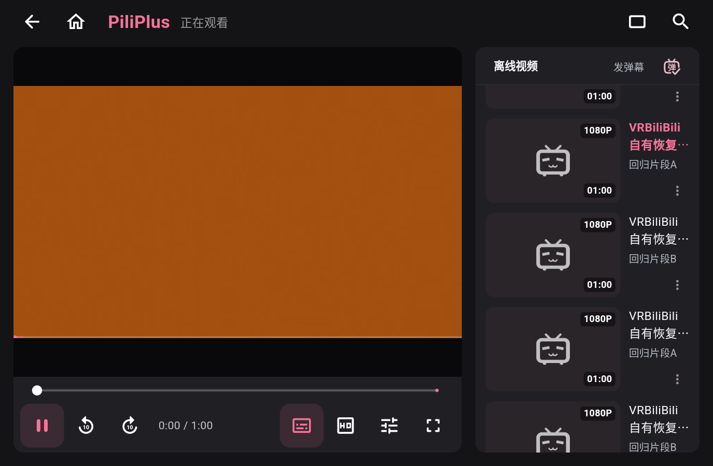
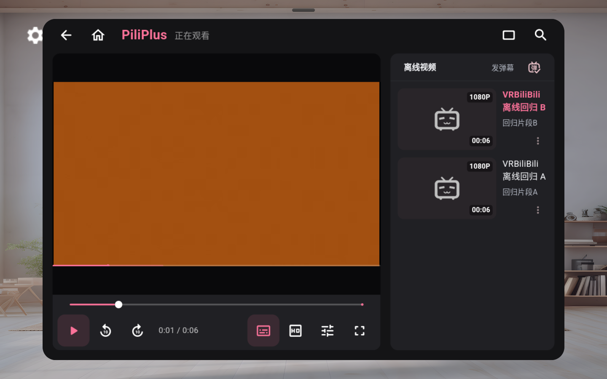
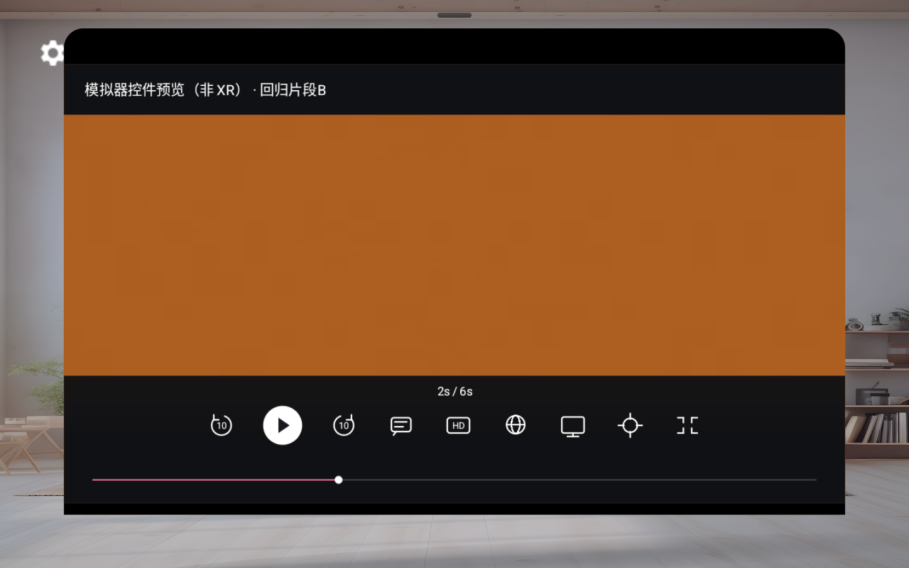

# VRBiliBili

面向 Meta Quest 3 的实验性 Bilibili 客户端，基于 PiliPlus。选片、账号和普通播放使用 PiliPlus；观看页提供大尺寸播放控件，以及固定屏幕的全屏影院入口。影院支持深色／浅色环境、纯画面模式和屏幕大小调整。

当前源码已合入本地缓存与影院返回的进度恢复修复。真实 Quest 的面板双 CID 隔离及新进程续播已通过；沉浸影院进出仍因未佩戴时系统睡眠阻断，需要用户佩戴后继续验收。2026-10-04 ARM64 本地测试候选为 `2.1.5-quest.20261004.4+2026100404`，关于页显示基础提交、补丁 SHA256 和构建标签。**含 Meta Spatial SDK 的公开 APK Release 仍待组合许可依据确认；目前没有可下载的正式 APK，不以源码压缩包代替 APK。** 详见 [二进制分发核查](docs/BINARY-DISTRIBUTION-REVIEW.md) 与 [本轮交付验收](docs/QUEST-ARM64-DELIVERY.md)。

## 应用截图

以下均为真实应用运行时的原始截图，播放内容是项目原创色块／音调测试片段。设备和覆盖边界分别标明，截图来源及哈希见 [记录](docs/screenshot-provenance.json)。



Quest 3 的实际 MainActivity 窗口，来自 Q4 候选的 R5 真机播放验证。它证明普通播放器界面与真实素材解码，不是 XR 合成器的双眼画面。素材实际为 320×180；1080P 为测试目录元数据。



隔离模拟器中，离线片段列表、播放进度和影院返回后的暂停状态。画面中的 1080P 为测试目录元数据；素材实际为 240×136。



原生播放控件的非 XR 预览；标题也明确标为“模拟器控件预览（非 XR）”。

## 安装与使用

公开 APK 尚未放行。已有本地授权测试包时，先确认来源、SHA256、包名和签名，再在已启用开发者模式、已授权的 Quest 连接上安装；此说明不要求更改配对或系统权限。

```text
adb -s <已授权设备序列号> install -r <经校验的ARM64测试APK>
```

本轮测试包使用既有调试包名 `io.github.vrbilibili.quest.debug` 和兼容签名，覆盖安装保留应用数据。签名冲突时应停止核查，不以卸载或清空数据绕过。应用可从 Quest 未知来源列表打开；选片后进入普通播放，点击“全屏影院”进入固定影院，使用“退出全屏”返回。账号登录由使用者自行完成；自动测试不登录、不操作现有账号。

## 开发与验证

客户端源码在 [clients/piliplus](clients/piliplus)，构建环境与固定依赖说明见 [开发环境](docs/DEVELOPMENT-ENVIRONMENT.md) 和 [客户端说明](docs/QUEST-CLIENT.md)。ARM64 打包可使用 `tools/quest-arm64.gradle` 明确排除依赖带入的其他 ABI；它不选择签名密钥。Android 重构建、真实设备测试及签名检查应按 [交付验收](docs/QUEST-ARM64-DELIVERY.md) 的边界执行。

```text
dart tests/dart/cinema_handoff_test.dart
```

恢复回归覆盖固定 CID 的进度保存、影院返回时等待写入、坏类型／负值／截断 Hive 尾帧容错、损坏下载记录跳过和多 CID 隔离。模拟器的五个真实应用进程阶段已通过；实际头显结果独立列在 [交付验收](docs/QUEST-ARM64-DELIVERY.md)，不会由 DOM 或模拟器测试代替。

历史 HTML 原型仍可打开 [prototype-preview.html](prototype-preview.html)。其账号、视频和播放状态为虚构演示，属于早期参考；浏览器验证方法见 [VALIDATION](docs/VALIDATION.md)。它不实现真实 Bilibili 解码或头显 XR。

## 上游与许可

客户端由 [PiliPlus](https://github.com/bggRGjQaUbCoE/PiliPlus) 固定提交 `c102a6115c7ac040f6a0c6a1653944b81b82dcb4` 修改，继承 GPLv3，完整许可保留在 [客户端 LICENSE](clients/piliplus/LICENSE)，修改与上游说明见 [VRBILIBILI-UPSTREAM](clients/piliplus/VRBILIBILI-UPSTREAM.md)。本项目与 Bilibili、Meta 无官方关联，也未获得其背书。

Meta Spatial SDK、播放器原生组件及其他依赖各自适用其许可。见 [第三方说明](docs/THIRD-PARTY-NOTICES.md)、[资产来源](docs/client-asset-provenance.json)、[原创测试素材](tests/fixtures/README.md) 和 [APK 分发待决事项](docs/BINARY-DISTRIBUTION-REVIEW.md)。源码公开不等于包含第三方 SDK 的组合 APK 已可分发。
