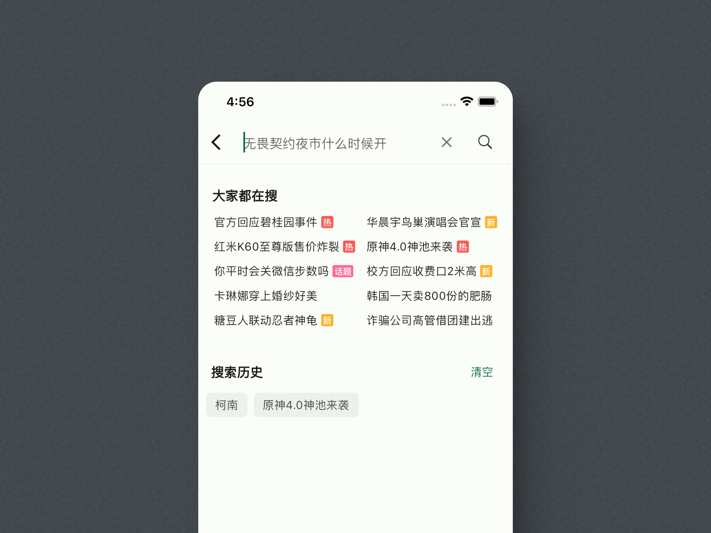
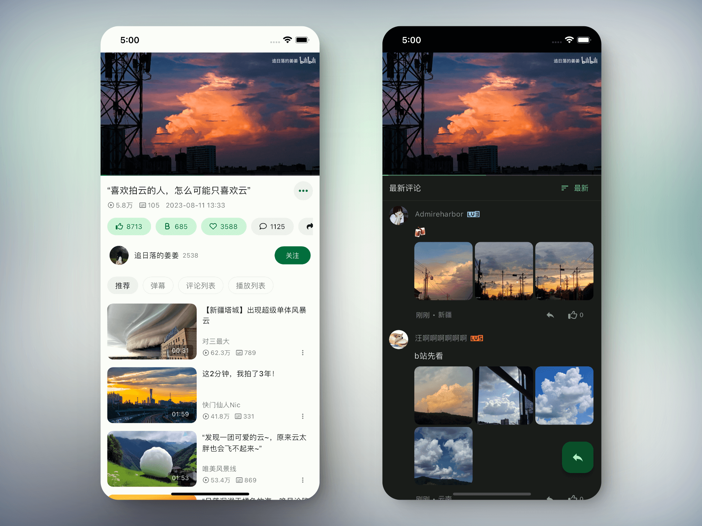
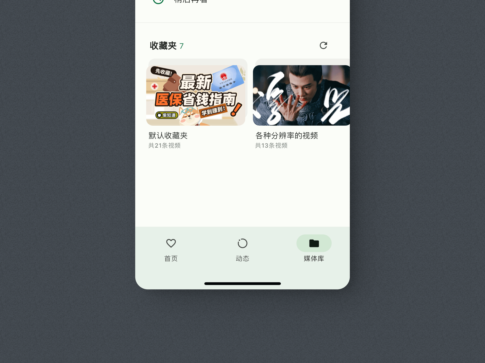

    
    <h1>PiliPlus</h1>

[中文](README.md) | English

    
A third-party Bilibili client built with Flutter

 

 

 

## Download

Download a build from [Releases](https://github.com/bggRGjQaUbCoE/PiliPlus/releases), or clone the repository and build it locally.

## Disclaimer

PiliPlus is a personal project developed for educational purposes, intended only for learning and testing. Please delete it within 24 hours of downloading.
All APIs used were collected from the official website. This project does not provide any cracked content.

Credit to the original project: [guozhigq/pilipala](https://github.com/guozhigq/pilipala).
Credit to the upstream project: [orz12/PiliPalaX](https://github.com/orz12/PiliPalaX).
This repository makes more extensive changes. Thank you to the original authors for sharing their work as open source.

Thank you for using PiliPlus.

## Acknowledgements

- [bilibili-API-collect](https://github.com/SocialSisterYi/bilibili-API-collect)
- [flutter_meedu_videoplayer](https://github.com/zezo357/flutter_meedu_videoplayer)
- [media-kit](https://github.com/media-kit/media-kit)
- [dio](https://pub.dev/packages/dio)
- And others

## Star History

<a href="https://star-history.dera.page/#bggRGjQaUbCoE/PiliPlus&Date">
 <picture>
   <source media="(prefers-color-scheme: dark)" srcset="https://star-history.dera.page/svg?repos=bggRGjQaUbCoE/PiliPlus&type=Date&theme=dark" />
   <source media="(prefers-color-scheme: light)" srcset="https://star-history.dera.page/svg?repos=bggRGjQaUbCoE/PiliPlus&type=Date" />
   
 </picture>
</a>