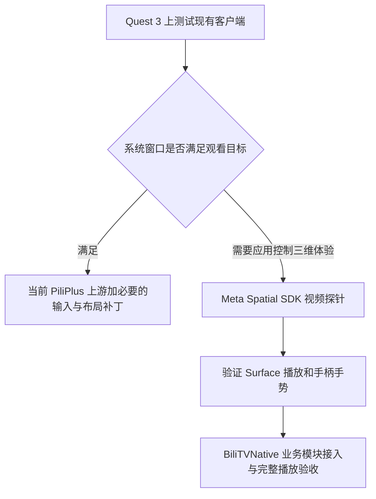
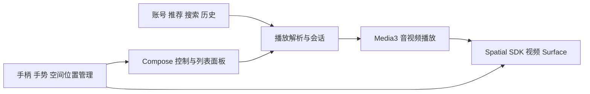

> 历史快照：保留原始版本、结果与经验；不构成当前目标或操作授权。旧“只读/不推送/不发布”、设备状态和源码-only 限制仅适用于记录当时阶段。当前状态见 [CURRENT-STATE](../CURRENT-STATE.md)；历史 pass 不自动等于当前 pass。

# B 站客户端迁移到 Quest 3：选型与实施方案

调研日期：2026-09-22。目标已确认：空间大屏观看普通 B 站视频，可移动、缩放，支持手柄和手势；用户有 Quest 3 可做真机测试。

**推荐顺序：先验证 PiliPlus 在 Horizon OS 系统窗口内的体验；需要修改时，以当前 PiliPlus 上游为基础，小范围借鉴 PiliPlusVR 的输入补丁。如果需要应用自己控制三维布局和影院环境，再采用 Meta Spatial SDK + Kotlin + Media3，以 BiliTVNative 为业务代码候选。**

本目录现在是设计资料，尚无已构建或已验收的 Quest 应用。完整操作用例见 [QUEST3-TEST-PLAN.md](QUEST3-TEST-PLAN.md)，来源与版本快照见 [research-snapshot.json](../research-snapshot.json)。

## 1. 先分清系统已经提供什么

Meta 官方确认：普通 Android 应用在 Quest 中运行于浮动窗口，用户可以移动、缩放和摆放；手柄射线和手指捏合被转换为 Android 输入事件。因此“空间大屏”不一定需要改成原生 VR 程序。效果仍受应用布局、输入处理、播放器和当前 Horizon OS 版本影响，需要真机确认。[窗口机制](https://developers.meta.com/horizon/essentials/horizon-os-panel-sizing/)、[输入与平台能力](https://developers.meta.com/horizon/documentation/android-apps/features-overview/)

| 路线 | 可以解决什么 | 改造量与使用条件 |
| --- | --- | --- |
| 现有 APK + 系统窗口 | 浮动观看、系统缩放移动、手柄/手势指针、系统多任务 | 最先测试，可能已满足主要需求 |
| 改造 Android / Flutter 窗口应用 | 更大的点击目标、横向布局、稳定拖动和返回、正常窗口恢复 | 推荐第一版；保留原有账号与播放实现 |
| Meta Spatial SDK 原生空间应用 | 应用控制的三维位置、独立视频表面、定制控制面板、MR/影院切换 | 当系统窗口确有不足时进入；增加空间渲染与生命周期工作 |
| Unity + OpenXR | 丰富影院场景、复杂 3D 交互、后续多种 XR 平台 | 若产品重点转为 3D 场景再考虑；安卓客户端业务需要桥接或移植 |
| WebXR 网页原型 | 快速展示交互和空间布局 | 可用于体验设计；账号、媒体请求及浏览器限制需另做验证 |

普通视频不会因为迁移到 Quest 就自动变成双目立体或 180°/360° 内容。第一版保留普通视频的正确比例与清晰度。

## 2. 具体选哪个项目

以下是代码与发布信息的核查结论，不是 Quest 播放实测排名。

| 项目 | 本次核查证据 | 建议角色 |
| --- | --- | --- |
| [PiliPlus](https://github.com/bggRGjQaUbCoE/PiliPlus) | Flutter 客户端，已有广泛 B 站功能；GitHub 当前 latest release 为 2.1.4，2026-09-13 发布 | **窗口版首选基础、功能基线** |
| [PiliPlusVR](https://github.com/Xunflash/PiliPlusVR) | 基于 PiliPlus；当前读取提交 `35c0a6cd`，latest release 为 2.0.7；相对共同祖先只有 9 个文件的净差异 | **Quest 输入适配参考和对照组**；不直接当成完整空间播放器 |
| [BiliTVNative](https://github.com/Hyper-Beast/BiliTVNative) | Kotlin + Compose + Media3；有独立播放请求、音视频轨道和 HTTP 请求头模型；读取提交 `ef2be933`，latest release 为 v1.0.1 | **原生空间版业务代码首选候选**，先通过构建及 Quest 播放门槛；README 明确直播暂缓 |
| [bilimiao2](https://github.com/10miaomiao/bilimiao2) | 原生安卓，包含既有播放与账号实现，README 列有 GSYVideoPlayer 等依赖 | 原生备选及业务参考；此次未深入审核其空间 Surface 接口 |
| [BBLL](https://github.com/xiaye13579/BBLL) | 本次 GitHub 默认分支根目录只有 README，未提供可改造的应用源码 | 可作为体验参考，不作为源码迁移底座 |
| [Meta Spatial SDK Samples](https://github.com/meta-quest/Meta-Spatial-SDK-Samples) | 官方空间应用与视频示例；读取提交 `f233e232` 对应样例更新至 SDK 0.14.0 | **空间渲染与交互的基础参考** |

PiliPlusVR 的关键核查：

- `PlatformUtils.initVR()` 按厂商名称识别 Meta/Oculus/Pico。
- 播放器对摇杆滚动、轴向漂移、快退节流、长按行为作了适配，另有点击识别与焦点调整。
- 比较结果没有新增原生空间渲染模块。结论是“当前已核查代码主要为安卓窗口输入适配”，不能据项目名推定其具备完整沉浸式 VR 功能。
- 比较时分支落后 PiliPlus 上游 456 个提交。长期维护应评估把少量有效补丁迁到当前上游，不以旧分支版本号作为最佳选择依据。

证据：[固定提交的设备识别](https://github.com/Xunflash/PiliPlusVR/blob/35c0a6cda38a2bb24a03a8c22d148a014f596c15/lib/utils/platform_utils.dart)、[播放器输入实现](https://github.com/Xunflash/PiliPlusVR/blob/35c0a6cda38a2bb24a03a8c22d148a014f596c15/lib/plugin/pl_player/view/view.dart)、[相对共同祖先的差异](https://github.com/Xunflash/PiliPlusVR/compare/f5dbfcec79eee523e67abd7667044c8b4cb816e5...35c0a6cda38a2bb24a03a8c22d148a014f596c15)。

两种 PiliPlus 版本不同，直接比较只能用于选型；若要证明某项 VR 补丁的效果，应在**同一上游提交**构建有补丁/无补丁两个版本。

## 3. 专门开发工具与可复用示例

| 工具或平台 | 本项目用途 |
| --- | --- |
| Android Studio + Android SDK + JDK | 编译、调试 Android / Kotlin 工程；Flutter 路线另外需要项目指定的 Flutter SDK |
| [Meta Spatial SDK](https://developers.meta.com/horizon/documentation/spatial-sdk/spatial-sdk-overview/) | 使用 Kotlin 与安卓 UI 开发空间应用，不必先学习完整游戏引擎 |
| Meta Spatial Editor | 可视化布置空间场景与资源；按所选官方示例的要求安装 |
| Meta Quest Developer Hub（MQDH）+ ADB | 识别设备、部署 APK、查看日志、投屏辅助人工验收 |
| [Meta Spatial Simulator](https://developers.meta.com/horizon/documentation/android-apps/spatial-sim-overview/) | 辅助检查窗口、布局与输入；能力以当前版本支持范围为准 |
| [OVR Metrics Tool](https://developers.meta.com/horizon/documentation/spatial-sdk/spatial-sdk-ovrmetrics/) | 记录头显帧率、CPU/GPU、发热与降频；结合播放器自身统计定位问题 |

相近的可复用工程均在 Meta 官方样例库：

- [HybridSample](https://github.com/meta-quest/Meta-Spatial-SDK-Samples/tree/f233e2327b95f9871b75bdba867d6fdd726f07cc/HybridSample)：普通窗口与沉浸模式切换。
- [MediaPlayerSample](https://github.com/meta-quest/Meta-Spatial-SDK-Samples/tree/f233e2327b95f9871b75bdba867d6fdd726f07cc/MediaPlayerSample)：视频选择、空间视频面板和透视切换。当前样例的平面网页视频与 ExoPlayer 360° 路径不同，不能只替换一个网址就当作 B 站播放器。
- [SpatialVideoSample](https://github.com/meta-quest/Meta-Spatial-SDK-Samples/tree/f233e2327b95f9871b75bdba867d6fdd726f07cc/SpatialVideoSample)：立体视频与空间音频，供后续扩展。
- [Media View](https://github.com/meta-quest/Meta-Spatial-SDK-Samples/tree/f233e2327b95f9871b75bdba867d6fdd726f07cc/Showcases/media_view)：更完整的媒体应用组织方式参考。

以固定样例提交的 Gradle wrapper、JDK、AGP、Kotlin、Spatial SDK 依赖组合为起点，先独立跑通样例，再整合 B 站模块。模拟器和普通 Android 模拟器都不能代替 Quest 上的解码、手势、续航与观看舒适度验收。

## 4. 第一轮如何测试并作决定

先测试 Quest 浏览器中的 B 站网页、PiliPlus 2.1.4、PiliPlusVR 2.0.7，以及原生候选 BiliTVNative v1.0.1。浏览器只作为同设备网络/账号/内容参照，不把网页成功直接解释成 APK 必然成功。

每个候选使用相同视频、账号权限、Wi-Fi 与清晰度，先查匿名普通投稿，再查登录后播放。记录实际画质和编码，不能只看菜单标识。

决策门槛：

1. **现有窗口版已满足主要目标**：保留窗口路线，只改测试暴露的输入、布局和恢复问题。
2. **窗口版可看，但需要精确三维布局或沉浸影院**：进入原生空间视频探针；不要先移植整个客户端。
3. **原客户端在 Quest 就不能完成基本播放**：先区分接口/登录、请求上下文、播放器和设备解码问题，再决定底座。
4. **BiliTVNative 无法通过构建、账号或播放基线**：取消其默认底座地位，评估 bilimiao2 或保留 PiliPlus；本次源码结构判断不覆盖实际可用性。

当前设备状态：只读执行 `adb devices -l` 时仅检测到一台小米电视，未检测到 Quest。未向任何设备安装或启动应用，也未修改设备设置。

## 5. 窗口版具体改什么

| 改动 | 实施方向与验收重点 |
| --- | --- |
| 布局 | 适配横向可变窗口，放大按钮与文字；窗口尺寸变化不重置视频与进度；少用要求精细拖动的小控件 |
| 输入 | 优先标准点击/悬停/滚动；对实际事件做诊断，验证摇杆轴、阈值与重复；不可把 Quest 手柄简单当成电视 D-pad |
| 返回 | 始终提供可点击返回入口；Meta 文档指出手势模式没有对应 Android Back 的返回手势 |
| 播放控制 | 暂停、快退/快进、倍速、画质、选集都有显式按钮；避免功能仅依赖手机长按或复杂滑动 |
| 登录 | 先复用扫码流程；头显里的虚拟二维码不能直接由旁边手机拍到，可通过电脑投屏呈现给手机扫描 |
| 生命周期 | 摘戴、系统菜单、应用切换、Surface 重建后恢复；暂停或继续音频策略明确，避免重复播放器 |
| 包与构建 | 核对 ARM64 与所有原生依赖；测试包用独立 applicationId 和稳定测试签名，防止与原客户端冲突 |

窗口输入事实来源：[Horizon OS AOSP features](https://developers.meta.com/horizon/documentation/android-apps/features-overview/)。窗口布局数值应在真机上调，不直接照搬手机或电视的字号和点击面积。

## 6. 原生空间版具体改什么

拟议架构如下；名称代表模块职责，不表示上游已存在完全相同的模块。

保留与移植的范围：

- B 站业务候选：`core/network`、账号与会话、`PlaybackRepository`、`PlaybackModels`、请求头、播放进度、分 P/选集。先形成可独立验证的接口边界。
- 现有代码的 `PlaybackInfo` 已区分视频轨、音频轨、清晰度、请求头，轨道包含备用地址与 SegmentBase。迁移时保留这些信息，不能把结果简化为一个 MP4 URL。
- 新增空间外壳、视频表面接线、独立控制面板与空间位置状态；电视的 D-pad 焦点导航仅作参考，重新设计手柄射线/手势输入。
- `ExoPlayer`、Surface、Activity/空间会话的创建与释放需要明确所有者；只保留一个当前播放会话，切换 2D/空间模式时保存并恢复进度和播放状态。

代码依据：[播放模型](https://github.com/Hyper-Beast/BiliTVNative/blob/ef2be9332a167f6cd797bc54b614162311984f3d/app/src/main/java/com/kirin/bilitv/core/player/PlaybackModels.kt)、[播放解析](https://github.com/Hyper-Beast/BiliTVNative/blob/ef2be9332a167f6cd797bc54b614162311984f3d/app/src/main/java/com/kirin/bilitv/core/player/PlaybackRepository.kt)。

视频输出优先采用 Meta 的 `VideoSurfacePanelRegistration`，由 ExoPlayer 输出到提供的 Surface；普通视频使用单目模式。视频与 UI 分层，避免把每帧视频经过截图或 CPU 读回再贴到 3D 物体。需要特效时再评估可读纹理路径的代价。[官方媒体面板文档](https://developers.meta.com/horizon/documentation/spatial-sdk/spatial-sdk-media-playback/)

第一版空间布局建议：前方一块保持视频比例的大屏，下方一条控制面板，侧面按需展开列表。默认屏幕留在空间中；提供重新居中和高度/距离调节。场景、曲面屏和头部跟随作为后续选项。

弹幕和字幕必须单独做叠层探针：原有 Android DanmakuView 不会自动出现在直接输出的视频 Surface 上。先验证字幕与控制层的遮挡、透明度和同步，再决定弹幕的面板/纹理方案与密度上限。

播放器请求按实际需要携带 UA/Referer/鉴权，凭证按域名和用途限制，不把完整 Cookie、二维码凭据或带签名媒体 URL 写进日志。播放信息过期时重新解析并恢复位置。可用画质由账号、接口与设备能力共同决定；DRM 支持的 SDK 接口不等于已获得具体内容的授权或可播放保证。

## 7. 三个可验收的交付阶段

| 阶段 | 交付物 | 继续条件 |
| --- | --- | --- |
| A：现有客户端基线 | 同设备对照记录，确定窗口路线的真实缺口 | 能完成搜索到持续观看；得到明确问题清单 |
| B：空间视频探针，仅在需要时 | 本地/公开测试视频，单个可移动缩放大屏，显式控制，手柄与手势 | 无持续黑屏；音画与生命周期正常；视频层和 UI 叠层已验证 |
| C：B 站空间 MVP | 扫码登录、推荐/搜索、播放、选集、画质/倍速、历史恢复、必要字幕/弹幕 | 通过完整 Quest 播放闭环与长时回归 |

先把一个客户端的观看闭环做完。评论编辑、私信、动态发布、下载管理、直播、多人同看、3D 内容转换不作为第一版阻塞项。将来迁移更多客户端时，复用验证过的空间播放器边界和测试用例，再按第二个真实客户端的需求抽象公共层。

## 8. 证据、许可与当前边界

本次沿客户端、空间平台、类似媒体项目三条检索线查看了 46 条 Exa 搜索结果（含重复与排除项），再通过 GitHub 连接器核对关键文件、差异和发布资产。搜索索引的更新时间不能替代当前 GitHub 读取结果。

PiliPlus/PiliPlusVR、bilimiao2 标示 GPL-3.0；BiliTVNative 的 LICENSE 为 MIT。Meta 样例代码主要为 MIT，但 SDK 与部分媒体/场景资产另有条款。实际移植按具体文件、依赖与资产记录来源，不能只看仓库首页的许可证标签。[BiliTVNative LICENSE](https://github.com/Hyper-Beast/BiliTVNative/blob/ef2be9332a167f6cd797bc54b614162311984f3d/LICENSE)、[Meta 样例许可说明](https://github.com/meta-quest/Meta-Spatial-SDK-Samples/blob/f233e2327b95f9871b75bdba867d6fdd726f07cc/README.md#license)

已完成：路线设计、候选版本与关键源码核查、只读 ADB 枚举、测试计划。未完成：APK 下载与独立校验、编译、Quest 安装、账号登录、真实播放与性能/舒适度验收。GitHub 提供的资产摘要记录在快照中，不代表本机已经下载验算，也不证明发布 APK 与所读源码完全一致。
